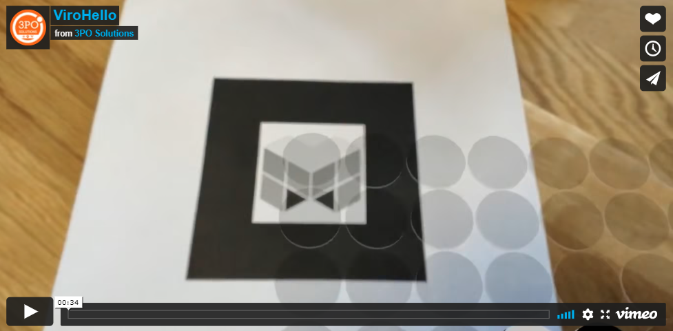

# ViroHello

ViroHello is a reversi game implementation using augmented reality thanks to [Viro React](https://viromedia.com/viroreact/) platform.

[](https://vimeo.com/646952573)

## Installation

```sh
npm install
```

## Development

```sh
npm start
```

## Test

```sh
npm test
```

## Contributors

- [3POS](https://github.com/3posol) 3PO Solutions LLC - creator, maintainer
